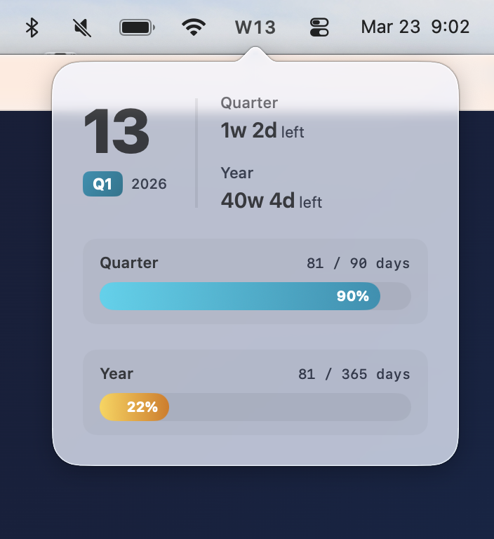

# Peek Week

Are we in week 3? Week 33? Now you know — **the current week number, always visible in your menu bar**.

Click it to see how much time is left in the quarter and year.



## Install

1. Download **peek-week-macos.dmg** from the [latest release](../../releases/latest)
2. Drag **Peek Week** to **Applications**
3. Launch — on first run it tries to enable start at login automatically

> macOS may warn about an unsigned app. Right-click → Open the first time.

## Build from source

```bash
git clone https://github.com/maxsumrall/peek-week.git
cd peek-week
./scripts/build-app.sh
open "build/Peek Week.app"
```

## License

MIT
