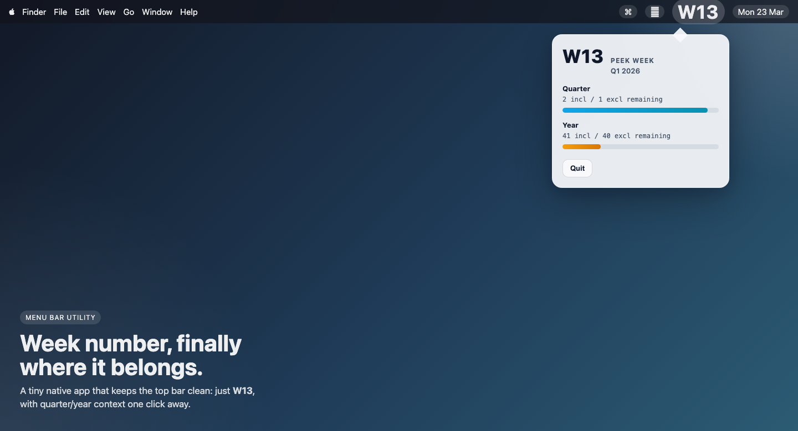
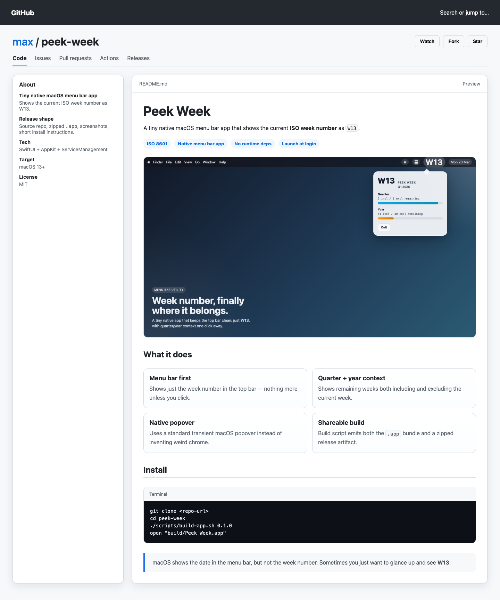

# Peek Week

A tiny native macOS menu bar app that shows the current **ISO week number** as `W14`.

Click the menu bar item to peek at quarter/year progress without turning this into a whole calendar app.



## What it does

- shows the current ISO 8601 week number in the menu bar
- opens a small native popover when you click it
- shows:
  - current week number
  - current quarter label
  - remaining weeks in the current quarter (`incl` and `excl` current week)
  - remaining weeks in the current year (`incl` and `excl` current week)
  - quarter and year progress bars
- enables **Launch at Login** on first run when macOS allows it
- stays tiny and dependency-free at runtime

## Why this exists

macOS shows the date in the menu bar, but not the week number.

Sometimes you just want to glance up and see `W14`.

## Install

### Easy path

1. Download the latest `peek-week-macos.zip` from Releases.
2. Unzip it.
3. Drag **Peek Week.app** into `/Applications`.
4. Launch it once.
5. If macOS complains because the app is unsigned, use **Right click → Open** the first time.

### Build locally

```bash
git clone <your-repo-url>
cd peek-week
./scripts/build-app.sh 0.1.0
open "build/Peek Week.app"
```

## Development

The app is intentionally small:

- `Sources/PeekWeek/main.swift` — app, menu bar controller, week calculations, and popover UI
- `scripts/build-app.sh` — builds the `.app` bundle and zipped release artifact
- `.github/workflows/release.yml` — GitHub Actions workflow for macOS release builds

### Local build

```bash
./scripts/build-app.sh
```

Outputs:

- `build/Peek Week.app`
- `build/peek-week-macos.zip`

## Design choices

- **ISO 8601** weeks, because that is what most people mean when they say `W14`
- **native SwiftUI/AppKit** instead of a script host or third-party menu bar tool
- **popover, not a full settings window**
- **no feature creep**

## Screenshots

### Menu bar app


### GitHub-style README preview



## Notes

- The release artifact is currently intended to be simple and shareable, not fully notarized.
- If you want a smoother download/install story for strangers, add proper Apple signing + notarization later.

## License

MIT
